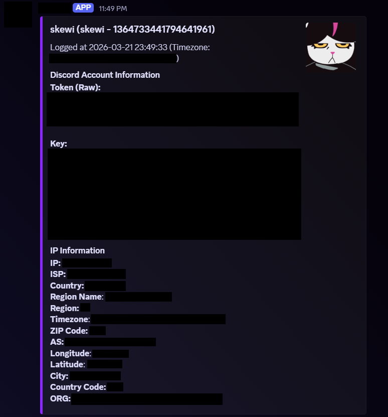

# ARCHIVED
this was written in like december 2025.

# EXAMPLE


# READ
this is an archive of a **really shitty** and messy discord token + ip logger i wrote a while ago out of boredom.
steal it if you want to, i dont care like at all.
this is bad

# how it work
this reads your discord local storage files and send the stored tokens and keys and stuffs through a discord webhook.
(you will have to decrypt everything with python manually)

# How..
```actionscript
new Diddenbludden().troll();
```
